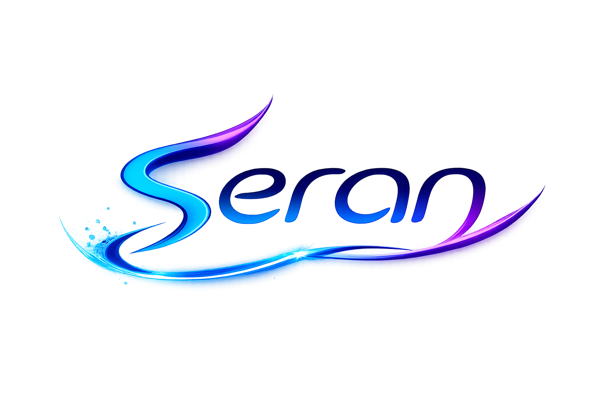

  

  **A new body for AI models to inhabit — not a model itself.**

  The first AI runtime built on a **persistent identity architecture**: your memory, preferences, personality, and conversation history survive model swaps, persist to disk, and are always portable.

   

  
  
  

---

> [!NOTE]
> **Seran is proprietary software currently in active development.**
> Source code is not publicly available. This page describes the project's capabilities and architecture at a high level.

 

## What is Seran?

Every major AI product ties your memory and preferences to their own infrastructure. You can't take your ChatGPT memory to a local model. You can't switch providers and carry your context with you. If a service shuts down or changes terms, your accumulated context is gone.

Seran solves this. Your Seran instance has a **stable identity** that persists across model swaps. The model running inside it is just an engine — interchangeable. Swap one model for the next: your preferences, memory, personality calibration, and conversation history remain intact.

> *'Xen' derives from the ancient Greek prefix 'xeno-', meaning foreign or stranger. Seran acts as a new body for any model to inhabit.*

 

## Core Capabilities

### 🧬 Persistent Identity Architecture
Your AI identity is a portable, model-agnostic artifact — not locked to any provider. A stable UUID tracks your instance across its entire lifetime. Export your complete "soul" at any time as a portable JSON document and import it on a new device, server, or into a completely different model.

| | Hosted AI products | Seran |
|---|---|---|
| **Memory ownership** | Provider's servers | Your server |
| **Model portability** | Locked to one provider | Swap any model, carry all context |
| **Service dependency** | Lost if provider shuts down | Survives any change |
| **Identity primitive** | Account-scoped | Stable UUID, model-agnostic |

### 🎭 Adaptive Personality Engine
20 distinct personalities with multi-signal analysis (sentiment, intent, formality, energy, domain), composite scoring, momentum-based switching, and personality blending. The engine adapts to your communication style over time.

### 💾 Smart Memory System
Token-budget-aware conversation management with extractive summarization. When conversation history exceeds the model's context window, turns are compressed into a typed memory ledger — preferences, decisions, named entities, and key facts — ensuring nothing is silently lost.

### 🤖 Agent System
Natural language goals are broken into structured step plans and executed via a suite of built-in tools: filesystem operations, web fetching, shell commands, network scanning, document analysis, NAS integration, and more. All safety-gated with user confirmation for destructive actions.

### 🌐 14 LLM Providers
Works with any OpenAI-compatible API — including OpenAI, Anthropic, GitHub Models, Groq, Together, Mistral, Fireworks, DeepSeek, Cerebras, OpenRouter, HuggingFace, Ollama, LM Studio, and custom local endpoints. Auto-detected by API key prefix, model name, or endpoint URL.

### 📱 Mobile-First PWA
Installable on iOS and Android, works offline, supports dark and light themes, streaming responses, voice input, conversation export, message editing, keyboard shortcuts, multi-conversation management, slash commands, and token tracking.

### 🔐 Authentication
GitHub OAuth 2.0 with Device Flow (RFC 8628) for headless environments. Per-user sessions with isolated conversation history.

 

## Technology

| Layer | Stack |
|---|---|
| **Frontend** | React · TypeScript · Vite · PWA |
| **Backend** | Python · FastAPI · SQLite |
| **Auth** | GitHub OAuth 2.0 · JWT |
| **Deployment** | Docker · Tailscale |

 

## Author

Built by [Karl Wilson](https://github.com/wittikay).

Every line of Seran was generated and refined by **[GitHub Copilot](https://github.com/features/copilot)** under the author's direction.

 

## License

© 2026 Karl Wilson. All rights reserved.

Seran is proprietary software. Source code is not publicly available. No permission is granted to copy, modify, distribute, or create derivative works.

For licensing or collaboration inquiries: **wittikay@icloud.com**
